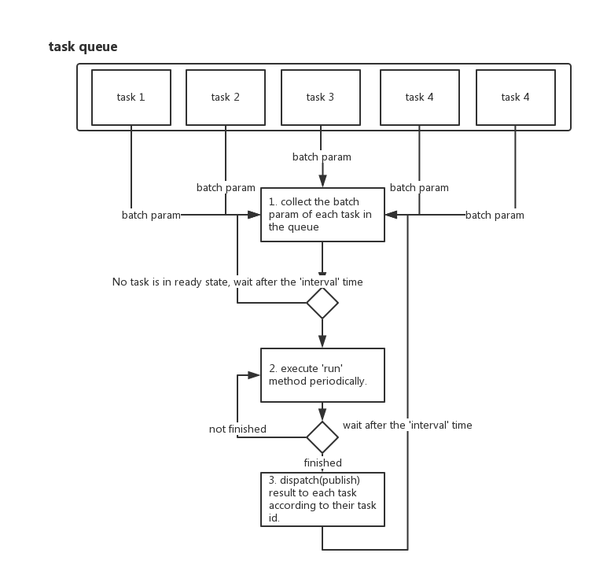

# task manager
This is a task manager framework in js. It provides you with an executor for a bunch of tasks and manage the lifecycle of your task, you could subscribe the lifecycle event.
Task could be an calculation which takes a long time,or an mission which should be executed periodically.

## how to use
You could include the task-manager.js under directory 'dest/' in your html.Like:
 ```sh
 <script type="text/javascript" src="/your_directory/task-manager.js"></script>
```
If you modified the source code and rebuild it, you need webpack installed globally:

```sh
$ npm install --save webpack
```
Then execute under root directory:
```sh
$ webpack
```

### Task

* create a task
   ```sh
       var taskManager = new TaskManager();
       taskManager.createTask({
            id : taskId,
            run : function(){
                //process code goes here
            }
       });
   ```
* subscribe a topic 
   ```sh
      var token = PubSub.subscribe(taskId,handler);
   ```
   'handler' is the function to process result when the task manager publish some result to the topic.  e.g.
   ```sh
        function handler(topic, res) {
        }
   ```
   The 'topic' is the topic you subscribed, 'res' is the data received.
   
   An unique token is returned to unsubscribe the topic.
   ```sh
      var token = PubSub.unsubscribe(token);
   ```
   
   Then a task is created and add to the task manager.To start is,you could call 'start'. e.g.
   ```sh
      taskManager.runTask(taskId);
   ```
Then you could leave it behind and process other code.

* Configurations
  + interval(optional,unit: millisecond)
    
    It defines how often the 'run' method of the task is executed. Default is 10000.

  + init (optional,function)
     
     Some initialization before running the task,it could return a promise , 'run' method is executed after the promise resolved.

  + run (required,function)
  
    The main job of this task, which could send http request to server(ajax),or an time consuming calculation, etc. After the user defined processing is done, task manager will publish the result to the specific taskId. Your 'handler'(metioned above) will receive the result(if exists) then decide to kill the task or repeat the task after 'interval'(metioned above) time.

    It could return a promise, then the publish action will take after the promise is resolved(It's useful when you are sending some ajax request).
    
  + kill (optional,function)

If is provided, it could be some work before killing an task.

* Api of a single task
  + createTask
  
    Create a single task.The configuration of a task is passed.Including:
      * interval(optional):interval of executing a task
      * id (required):unique id of the task
      * run(required): task mission
      * kill(optional): kill mission
     
    return : The task just created.

  + createTaskList
    
    Create a list of tasks. The configuration of the task list is passed. Including:
      * interval(optional):interval of executing a task
      * ids (required):list of id of the task
      * init(optional): init work before executing the task 
      * run(required): task mission
      * kill(optional): kill mission
    return : The list of tasks just created.
  + runTask 
   
    Start to run the task.The task id is passed.
    ```sh
      taskManager.runTask(taskId);
    ```
  +  runTaskList 
  
     Start to run the task list at the same time .Array of  task ids is passed.
     ```sh
      taskManager.runTask([taskid1,taskid2]);
     ```
  + pauseTask
    
     Pause a task. Task id is required.
     ```sh
       taskManager.pauseTask(taskId);
     ```
    
 + pauseTaskList
    
    Pause a list of tasks at the same time.Array of task ids is required.
    ```sh
      taskManager.pauseTaskList([taskId1,taskId2]);
    ```   
    
  + continueTask
    
     Wake up the task which is paused. Task id is required.
     ```sh
       taskManager.continueTask(taskId);
     ```
    
  + continueTaskList
    
    Wake up the task which is paused.Array of task ids is required.
    ```sh
      taskManager.continueTaskList([taskId1,taskId2]);
    ```   
  + killTask
    
     Kill the task. Task id is required.
     ```sh
       taskManager.killTask(taskId);
     ```
    
  + killTaskList
    
    Kill a list of tasks at the same time. Array of task ids is required.
    ```sh
      taskManager.killTaskList([taskId1,taskId2]);
    ```

# Batch Task
  There is a condition when serveral tasks share one execution method.
  

  + Task manager collects the 'batchParam' of each task in the task queue. The 'batchParam' is defined when creating a batch task,which is the data each specific task may need when batch process taking place.
  + Then execution shared by the batch tasks is called.
  + Results are dispatched(published) to each batch task according to their task id.
  + Each task may decide if it would attend next execution period or remove itself from the task queue according to the result they got(subscribe);
  + After the 'interval' time, the task manager will repeat the same process again until there is no task in the task queue.


* Api of a batch task
  + createBatchTask
     * option
         * id (required) : id of the task,should be unique!
         * init (function,optional):  init task
         * afterInit(function,optional): callback of init
         * callback(function,optional): callback of each response result(you may also subscribe the result)

     ```sh
        taskManager.createBatchTask({
             id: taskId,
             batchParams:{
                //params for this task during execution
             }
        });
     ```
  + killBatchTask
     * option
         * id (required) : id of the task
         * kill(function,optional): function before the task is killed

     ```sh
         taskManager.killBatchTask({
              id: taskId
         });

         //or you may just pass the task id
         taskManager.killBatchTask(taskId);
     ```
